# Sistema de Gestión de Eventos y Entradas

## Integrantes

* Sofía Acuña
* Anna Garello Bertorello
* Leticia Vega Pereira

## Materia

Desarrollo de Software - UCC

---

# Descripción

Sistema web para la gestión de eventos y venta de entradas inspirado en plataformas como Ticketek.

La aplicación permite a los usuarios registrarse, iniciar sesión, explorar eventos, consultar información detallada, adquirir entradas, administrar sus compras, transferir entradas a otros usuarios y calificar eventos mediante un sistema de puntuación.

Además, incorpora funcionalidades administrativas para la gestión de eventos y consulta de métricas de ventas y ocupación.

---

# Tecnologías Utilizadas

## Backend

* Go
* Gin
* GORM

## Frontend

* React
* React Router

## Base de Datos

* MySQL

## Seguridad

* JWT (JSON Web Token)
* Hashing de contraseñas

## Infraestructura

* Docker
* Docker Compose

## Testing

* Go Testing
* Testify

---

# Arquitectura

El proyecto fue desarrollado utilizando una arquitectura por capas:

```text
Frontend (React)
        ↓
API REST (Gin)
        ↓
Controllers
        ↓
Services
        ↓
DAO
        ↓
MySQL
```

Esta arquitectura permite desacoplar la interfaz de usuario, la lógica de negocio y el acceso a datos, mejorando la mantenibilidad y escalabilidad del sistema.

---

# Funcionalidades Implementadas

## Cliente

* Registro e inicio de sesión.
* Exploración de eventos.
* Consulta de detalle de eventos.
* Compra de entradas.
* Consulta de historial de entradas adquiridas.
* Cancelación de entradas.
* Transferencia de entradas entre usuarios.
* Puntuación de eventos.
* Ranking de eventos mejor calificados.

## Administrador

* Creación de eventos.
* Modificación de eventos.
* Eliminación de eventos.
* Consulta de métricas de ocupación.
* Consulta de reportes de ventas.

---

# Funcionalidad Adicional

## Sistema de Puntuación

Los usuarios pueden calificar eventos utilizando una escala de 0 a 5 estrellas.

El sistema calcula automáticamente el promedio de puntuaciones y genera un ranking de eventos ordenados según su valoración.

Cada usuario puede puntuar un evento una única vez.

---

# Requisitos Previos

Antes de ejecutar el proyecto es necesario contar con:

* Go 1.26 o superior
* Node.js
* npm
* MySQL
* Docker Desktop
* Git

---

# Instalación Local

## Clonar repositorio

```bash
git clone https://github.com/sofiacunax/Proyecto-desarrollo-sw.git
```

## Backend

```bash
cd backend

go mod download

go run main.go
```

## Frontend

```bash
cd frontend

npm install

npm run dev
```

---

# Ejecución con Docker

El proyecto se encuentra completamente dockerizado mediante Docker Compose.

## Servicios incluidos

* Frontend
* Backend
* MySQL

## Levantar aplicación

```bash
docker compose up --build
```

## Puertos

| Servicio | Puerto |
| -------- | ------ |
| Frontend | 5173   |
| Backend  | 8080   |
| MySQL    | 3306   |

---

# Testing

Ejecutar todos los tests:

```bash
go test ./...
```

Ejecutar con cobertura:

```bash
go test ./... -cover
```

Generar reporte de cobertura:

```bash
go test ./... -coverprofile=coverage.out

go tool cover -func=coverage.out
```

---

# Capturas de Pantalla

## Login

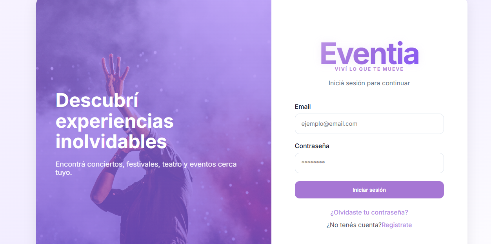

## Dashboard

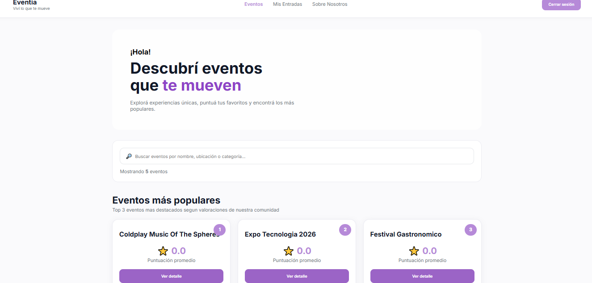
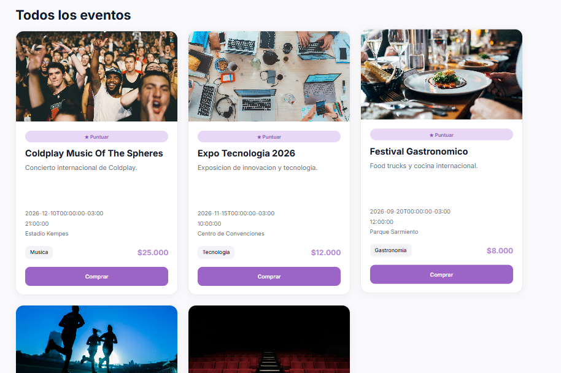

## Compra de Entradas


## Mis Entradas

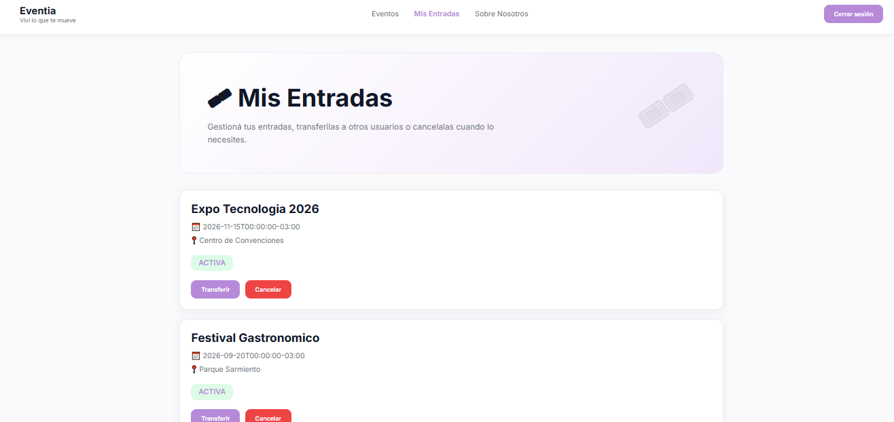

## Transferencia de Entradas

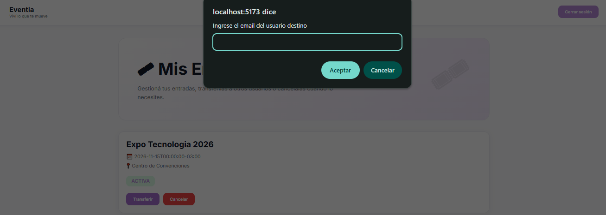

## Ranking de Eventos

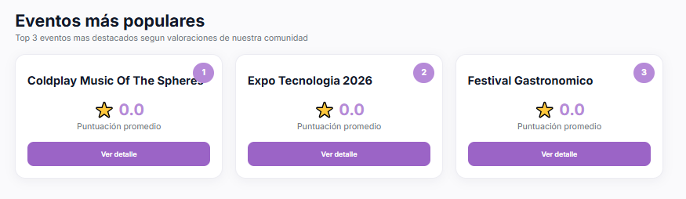

## Administrador

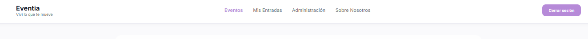
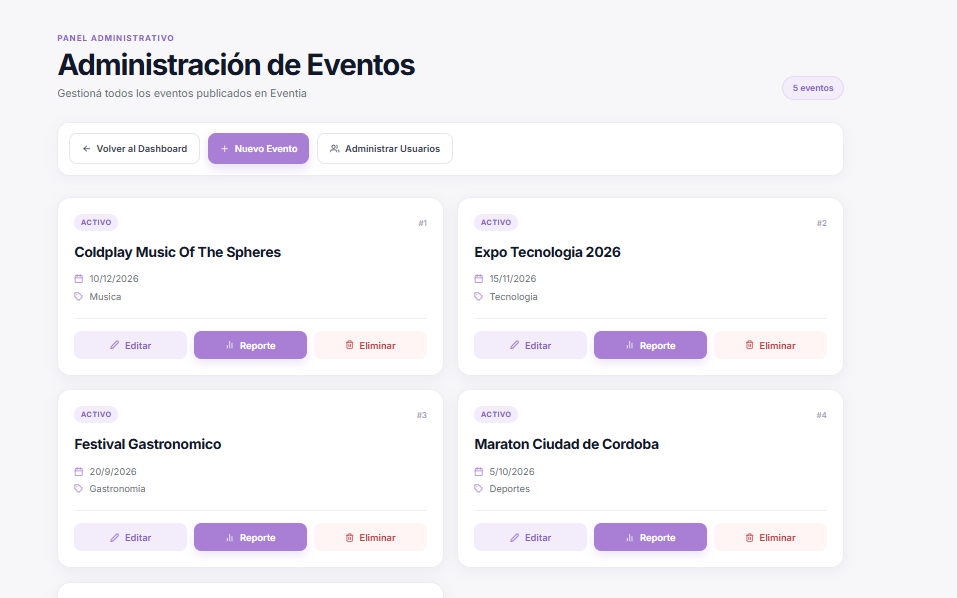
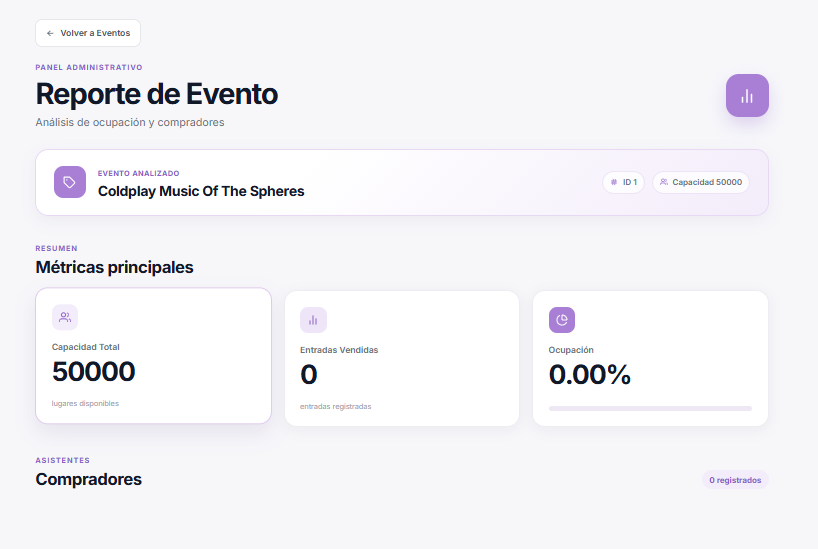
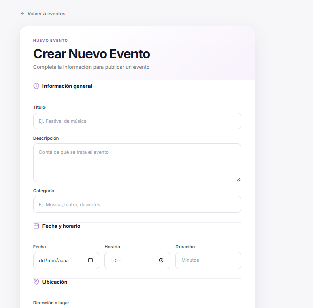
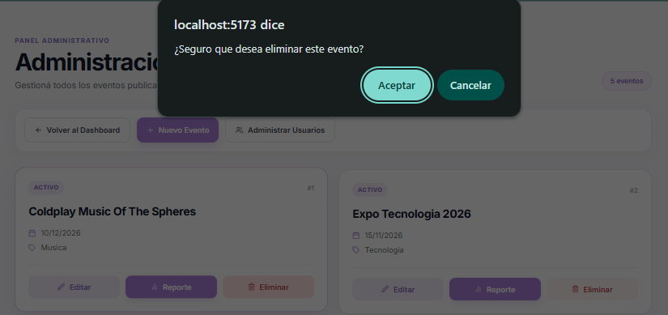
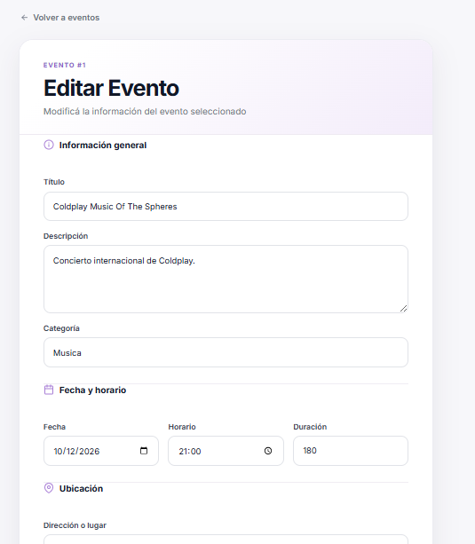
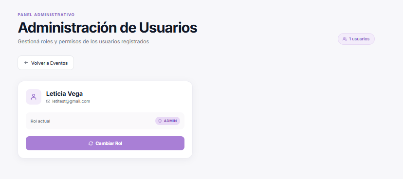


---

# Diagrama de Base de Datos

El siguiente diagrama representa las entidades principales del sistema y sus relaciones.

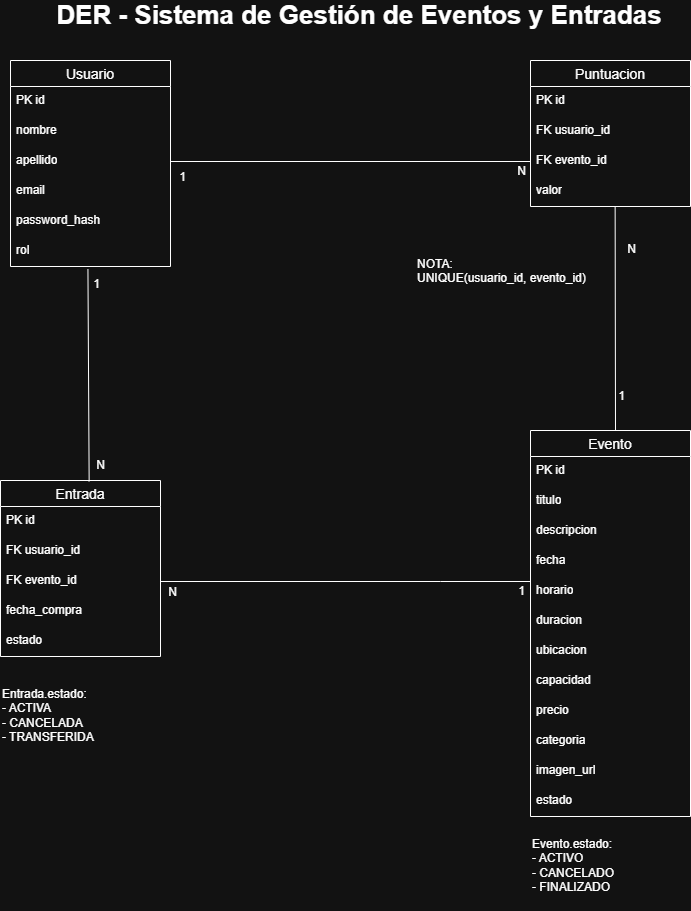

---

# Decisiones de Diseño

## Arquitectura por Capas

Se implementó una arquitectura Controller → Service → DAO para separar responsabilidades y facilitar el mantenimiento del sistema.

## Autenticación mediante JWT

Se utilizaron tokens JWT para proteger los endpoints sensibles y garantizar la autenticación de los usuarios.

## Uso de DTOs

Se utilizaron DTOs para desacoplar los modelos internos de la información expuesta mediante la API REST.

## Transferencia de Entradas

La transferencia de entradas mantiene la integridad del historial modificando únicamente el propietario de la entrada sin recrear registros.

## Sistema de Puntuaciones

Se implementó una restricción que impide que un mismo usuario pueda puntuar un evento más de una vez.

---

# Estructura del Proyecto

```text
Proyecto-desarrollo-sw/
│
├── backend/
├── frontend/
├── docs/
├── docker-compose.yml
├── .env
├── .env.example
└── README.md
```
